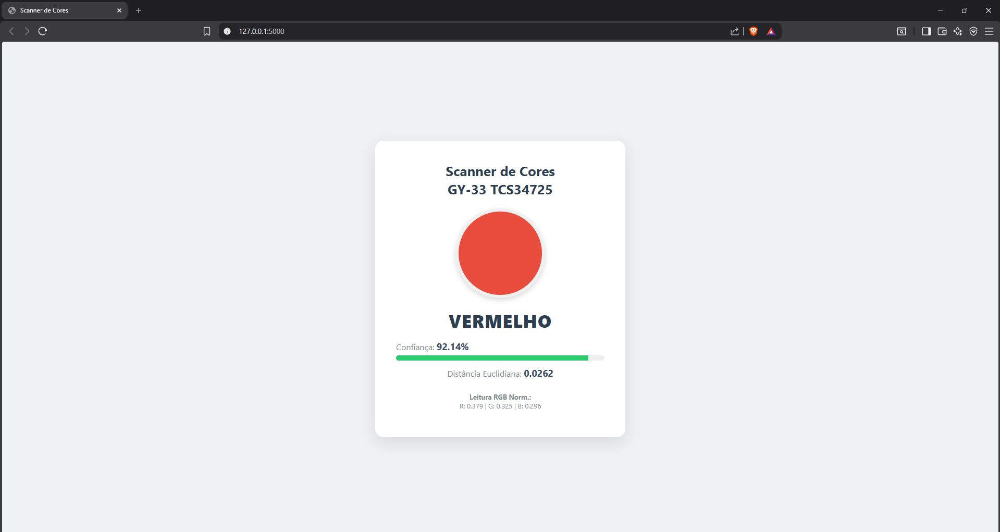

# Scanner de Cores com Sensor TCS34725

> Sistema de detecção e classificação de cores em tempo real baseado em Raspberry Pi e sensor TCS34725, com interface web via Flask, suporte a calibração de cores personalizada e estimativa de código hexadecimal.

## Sobre o Projeto

Este projeto utiliza uma Raspberry Pi como classificador de cores físico. Utilizando o sensor **TCS34725** através da comunicação I2C, o sistema captura a luz refletida pelo objeto e realiza a leitura dos canais Vermelho, Verde, Azul (RGB) e Clear (Luminosidade).

### Interface Web

*(Interface web que exibe a cor detectada, a confiança da leitura, valores RGB normalizados e a cor hexadecimal estimada)*

### Hardware Utilizado

*(Montagem física detalhando a conexão do sensor de cor TCS34725 no Raspberry Pi através do barramento I2C)*

## Funcionalidades

- **Interface Web Dinâmica:** Uma API Flask processa leituras instantâneas que exibe o resultado da análise de forma responsiva.
- **Filtro de Ruído:** O sensor coleta múltiplas amostras (podendo descartar leituras extremas) e calcula médias antes de classificar a cor, garantindo alta precisão na leitura.
- **Sistema de Calibração:** Script interativo em linha de comando (`calibrar_cores.py`) que permite ao usuário cadastrar novas cores no banco de dados local (`cores_calibradas.json`).
- **Fallback Universal:** Dicionário embutido com as cores primárias e secundárias absolutas que age automaticamente quando a confiança da calibração for inferior a 30%.

## Tecnologias e Requisitos

**Hardware:**
- Raspberry Pi 3 Model B (Com pinos I2C habilitados).
- Sensor de Cor **TCS34725** (Adafruit ou genérico).
- Cabos Jumper.

**Software e Bibliotecas:**
- Python 3
- Flask (Framework web)
- lib: `adafruit-circuitpython-tcs34725`
- lib: `board` e `busio` (Bilt-in no CircuitPython)

## 📁 Estrutura do Projeto

- `app.py`: Arquivo principal do servidor Flask. Renderiza a interface web, expõe a API em `/api/cor` e implementa a lógica de classificação entre referências calibradas e o dicionário universal.
- `sensor_cor.py`: Classe base de comunicação com o hardware. Gerencia integração, ganho, limpa ruídos, gera médias e calcula distâncias euclidianas entre leitores RGB.
- `calibrar_cores.py`: Script CLI para cadastrar fisicamente o perfil de cor de novos objetos.
- `identificar_cor.py`: Utilitário de terminal para monitorar e testar as detecções em tempo real sem precisar iniciar o servidor web.
- `cores_calibradas.json`: Banco de dados gerado automaticamente que armazena os padrões normalizados das cores salvas pelo usuário.
- `templates/`: Diretório contendo o `index.html` da página web servida pelo Flask.
- `img/`: Contém as imagens do hardware e prints da interface para esta documentação.
